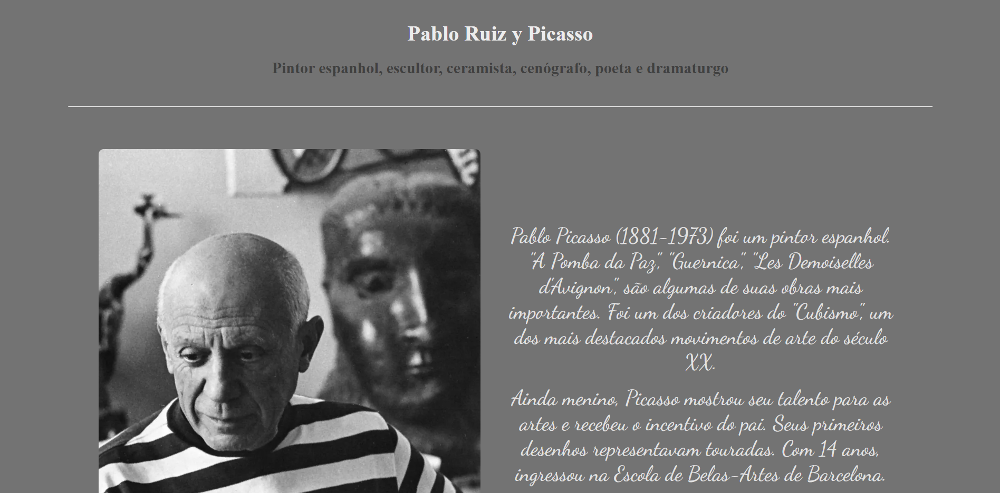

<h1 align="center">Tributo a Picasso</h1>

 

<kbd>

<h6 align="right">Largura 1920px</h6>

>Exercício

Projeto de construção de um site de tributo do 0.  

[Clique aqui para acessar o site.](https://scgui.github.io/medicenter)

## 🔧 Tecnologias

- HTML
- CSS
- Git e Github

## O que aprendi

- Aprimorar o uso do Flexbox
- Mensurar dimensão de ocupação de div's
- Manipulação de imagens

## 🔌 Contato

guics37.go@gmail.com
